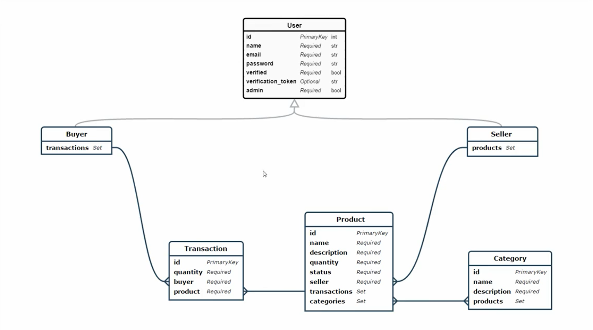

LaravelRestApiHateoas
========================
Build a RESTfull API Hateoas with Laravel 5.5

  

Content
========================
Learn how to:

Udemy : https://www.udemy.com/restful-api-with-laravel-php-homestead-passport-hateoas/
Sources : https://github.com/JuanDMeGon/RESTful-API-with-Laravel-Definitive-Guide

Install
========================
1 - Clone : git clone https://github.com/molodoi/LaravelRestApiHateoas.git

2 - Make : composer install

3 - Create database name restfullapi

4 - Make : php artisan migrate 

5 - Make : php artisan db:seed

6 - Make : npm install